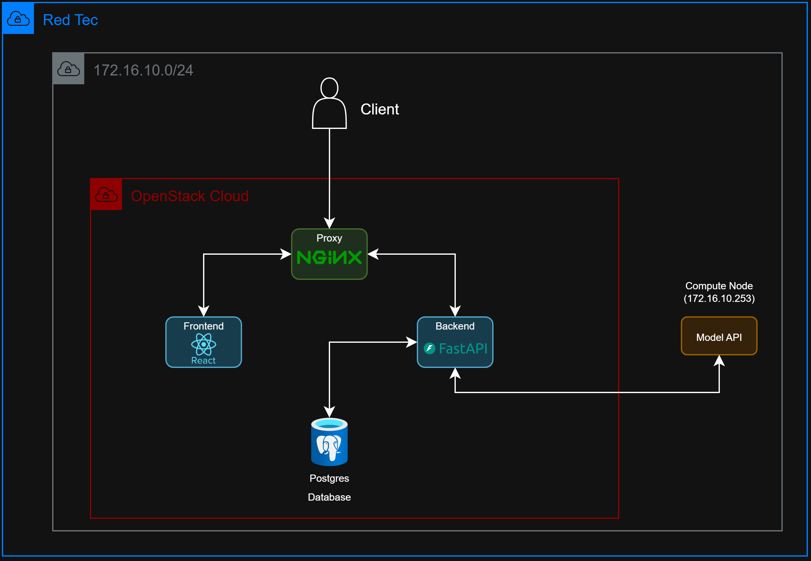

# MLB Baseball Game Simulator

An end-to-end MLB game prediction platform that pairs a LightGBM-based Monte Carlo simulator with a full-stack web application. Users can browse the weekly MLB schedule, explore 2024 player statistics, build custom lineups, and run their own game simulations to generate win probabilities and per-inning stats.

## Architecture

```
┌─────────────────┐     HTTP/JSON      ┌──────────────────────┐
│   React Frontend│ ◄────────────────► │   FastAPI Backend     │
│   (port 5173)   │  cookies + REST    │   (port 8000)         │
└─────────────────┘                    └──────────┬───────────┘
                                                   │ HTTP/JSON
                                                   ▼
                                        ┌──────────────────────┐
                                        │   FastAPI Model API   │
                                        │   (port 8001)         │
                                        │   LightGBM + Rules    │
                                        └──────────────────────┘
                                                   │
                                        ┌──────────▼───────────┐
                                        │   PostgreSQL DB       │
                                        │   (port 5432)         │
                                        └──────────────────────┘
```



| Service | Stack | Port | Directory |
|---|---|---|---|
| **Frontend** | React Router v7 + TypeScript + TailwindCSS v4 | 5173 | `frontend/` |
| **Backend API** | FastAPI + asyncpg + SQLAlchemy 2.0 (async) | 8000 | `backend/` |
| **Model API** | FastAPI + LightGBM | 8001 | `model/model_api/` |
| **Database** | PostgreSQL 12+ | 5432 | — |

## How It Works

1. The **Frontend** lets users pick real MLB players from the 2024 stats database and submit lineup cards to run a simulation.
2. The **Backend API** resolves player IDs to stat arrays, proxies the simulation request to the Model API, aggregates the results, and stores them in PostgreSQL.
3. The **Model API** runs N Monte Carlo simulations using a LightGBM model trained on 2024–2025 Statcast pitch data. Each simulation plays a complete 9-inning game plate-appearance by plate-appearance.
4. Results (win probability, per-inning averages, hit/HR/strikeout averages) are returned to the frontend for display.

## Repository Structure

```
TEC-Final-Assessment/
├── backend/            # FastAPI backend + PostgreSQL ORM
│   ├── app/
│   │   ├── main.py
│   │   ├── config.py
│   │   ├── routes/     # auth, simulations, players, schedule
│   │   ├── models/     # SQLAlchemy models
│   │   ├── services/   # lineups resolver, results aggregator
│   │   ├── utils/      # JWT dependency, password hashing
│   │   └── db/         # async engine + session factory
│   └── README.md       # Full backend docs
├── frontend/           # React Router v7 SPA
│   ├── app/
│   │   ├── routes/     # home, dashboard, sandbox, statistics, history, auth
│   │   ├── components/ # Sidebar, Graphs
│   │   ├── contexts/   # UserContext
│   │   ├── api/        # typed fetch wrappers
│   │   └── utils/      # auth guard
│   └── README.md       # Full frontend docs
├── model/
│   ├── model_api/      # FastAPI wrapper around the simulation engine
│   ├── simulation/     # GameState engine + ModelSampler + predict entry point
│   ├── model_trainning/# LightGBM training script
│   ├── download_data/  # Statcast + lineup download pipeline
│   └── README.md       # Full ML pipeline docs
└── images/             # Architecture diagrams
```

## Quick Start (Local Development)

### Prerequisites

- Python 3.10+
- Node.js 20+
- PostgreSQL 12+
- The trained model artifact at `model/simulation/models/pa_model.txt` and `model/simulation/data/feature_names.csv`

### 1 — PostgreSQL

```bash
sudo -u postgres psql <<'SQL'
CREATE ROLE itcdreamteam WITH LOGIN PASSWORD 'your_secure_password';
CREATE DATABASE tec_final_assessment OWNER itcdreamteam;
GRANT ALL PRIVILEGES ON DATABASE tec_final_assessment TO itcdreamteam;
SQL
```

Ensure `pg_hba.conf` uses `scram-sha-256` (not `peer`/`ident`). See `backend/README.md` for details.

### 2 — Backend API

```bash
cd backend
python -m venv venv && source venv/bin/activate
pip install -r requirements.txt
cp .env.example .env          # fill in DATABASE_URL, SECRET_KEY
python -m app.db.scripts.init_db
python -m app.db.scripts.seed_players
uvicorn app.main:app --reload --host 0.0.0.0 --port 8000
```

### 3 — Model API

```bash
cd model/model_api
pip install -r requirements.txt   # or reuse the venv with lightgbm added
uvicorn main:app --reload --port 8001
```

### 4 — Frontend

```bash
cd frontend
npm install
cp .env.example .env              # set VITE_API_URL=http://localhost:8000
npm run dev
```

Open **http://localhost:5173** in your browser.

### Swagger UIs

- Backend: http://localhost:8000/docs
- Model API: http://localhost:8001/docs

---

## Deployment Guide

This section covers deploying all three services on a single Linux VM or on separate VMs behind a reverse proxy.

### Single-VM with systemd + Nginx

#### Environment layout

```
/srv/baseball/
├── backend/           (git clone or scp)
├── model/             (git clone or scp)
└── frontend/          (production build output)
```

#### 1. PostgreSQL (production)

Follow the same role/database creation steps from Quick Start. Set a strong password and record it for `DATABASE_URL`.

#### 2. Backend — systemd service

Create `/etc/systemd/system/baseball-backend.service`:

```ini
[Unit]
Description=Baseball Simulator Backend API
After=network.target postgresql.service

[Service]
User=www-data
WorkingDirectory=/srv/baseball/backend
EnvironmentFile=/srv/baseball/backend/.env
ExecStart=/srv/baseball/backend/venv/bin/uvicorn app.main:app \
    --host 127.0.0.1 --port 8000 --workers 2
Restart=always

[Install]
WantedBy=multi-user.target
```

Production `.env` additions:

```env
DATABASE_URL=postgresql+asyncpg://itcdreamteam:<password>@localhost:5432/tec_final_assessment
SECRET_KEY=<64-char random string>
ALGORITHM=HS256
ACCESS_TOKEN_EXPIRE_MINUTES=30
MODEL_API_URL=http://127.0.0.1:8001
FRONTEND_URL=https://yourdomain.com
```

> Set `secure=True` on the cookie in `backend/app/routes/auth.py` when running over HTTPS.

Enable and start:

```bash
sudo systemctl daemon-reload
sudo systemctl enable --now baseball-backend
```

#### 3. Model API — systemd service

Create `/etc/systemd/system/baseball-model.service`:

```ini
[Unit]
Description=Baseball Model API
After=network.target

[Service]
User=www-data
WorkingDirectory=/srv/baseball/model/model_api
EnvironmentFile=/srv/baseball/model/model_api/.env
ExecStart=/srv/baseball/backend/venv/bin/uvicorn main:app \
    --host 127.0.0.1 --port 8001 --workers 1
Restart=always

[Install]
WantedBy=multi-user.target
```

Model API `.env`:

```env
FRONTEND_URL=https://yourdomain.com
```

> Use `--workers 1` for the Model API because the LightGBM model is loaded once into process memory; multiple workers each load their own copy, multiplying RAM usage.

```bash
sudo systemctl enable --now baseball-model
```

#### 4. Frontend — production build

```bash
cd /srv/baseball/frontend
npm ci
VITE_API_URL=https://yourdomain.com/api npm run build
```

Or set `VITE_API_URL` in the `.env` file before building. The built output lands in `frontend/build/`.

**Option A — serve with Node (React Router SSR)**

```ini
# /etc/systemd/system/baseball-frontend.service
[Unit]
Description=Baseball Frontend
After=network.target

[Service]
User=www-data
WorkingDirectory=/srv/baseball/frontend
Environment=PORT=3000
ExecStart=/usr/bin/node /srv/baseball/frontend/node_modules/.bin/react-router-serve ./build/server/index.js
Restart=always
```

**Option B — serve static files with Nginx directly** (if SSR is not needed)

Copy `frontend/build/client/` to `/var/www/baseball/` and configure Nginx to serve it as a static site with `try_files $uri /index.html`.

#### 5. Nginx reverse proxy

```nginx
# /etc/nginx/sites-available/baseball
server {
    listen 80;
    server_name yourdomain.com;
    return 301 https://$host$request_uri;
}

server {
    listen 443 ssl; # if using https
    server_name yourdomain.com;

    ssl_certificate     /etc/letsencrypt/live/yourdomain.com/fullchain.pem;
    ssl_certificate_key /etc/letsencrypt/live/yourdomain.com/privkey.pem;

    # Frontend
    location / {
        proxy_pass http://127.0.0.1:3000;
        proxy_set_header Host $host;
        proxy_set_header X-Real-IP $remote_addr;
    }

    # Backend API — strip the /api prefix
    location /api/ {
        rewrite ^/api(/.*)$ $1 break;
        proxy_pass http://127.0.0.1:8000;
        proxy_set_header Host $host;
        proxy_set_header X-Real-IP $remote_addr;
        proxy_set_header Cookie $http_cookie;
    }
}
```

Enable:
```bash
sudo ln -s /etc/nginx/sites-available/baseball /etc/nginx/sites-enabled/
sudo nginx -t && sudo systemctl reload nginx
```

#### 6. Docker (alternative)

A `Dockerfile` is provided for the frontend (`frontend/Dockerfile`). Build and run it:

```bash
cd frontend
docker build -t baseball-frontend .
docker run -d -p 3000:3000 \
  -e VITE_API_URL=https://yourdomain.com/api \
  baseball-frontend
```

The backend and model API can be containerized similarly — add a `Dockerfile` copying `backend/` and running `uvicorn`.

### Database initialization (first deploy)

```bash
cd /srv/baseball/backend
source venv/bin/activate
python -m app.db.scripts.init_db      # create tables
python -m app.db.scripts.seed_players # load 2024 MLB player stats
```

### Checklist before go-live

- [ ] `SECRET_KEY` is a random 64-character string, not the example value
- [ ] `secure=True` set on cookies in `auth.py` (requires HTTPS)
- [ ] `FRONTEND_URL` in backend `.env` matches the deployed domain
- [ ] `VITE_API_URL` in frontend `.env` points to the public API URL
- [ ] PostgreSQL accepts connections only from localhost (default) or a trusted CIDR
- [ ] Model artifacts (`pa_model.txt`, `feature_names.csv`) are present in `model/simulation/`

---

## Service READMEs

Each service has its own detailed documentation:

- [`backend/README.md`](backend/README.md) — API endpoints, auth system, database models, setup
- [`frontend/README.md`](frontend/README.md) — routes, components, API integration, setup
- [`model/README.md`](model/README.md) — ML pipeline, data schemas, simulation flow, results
